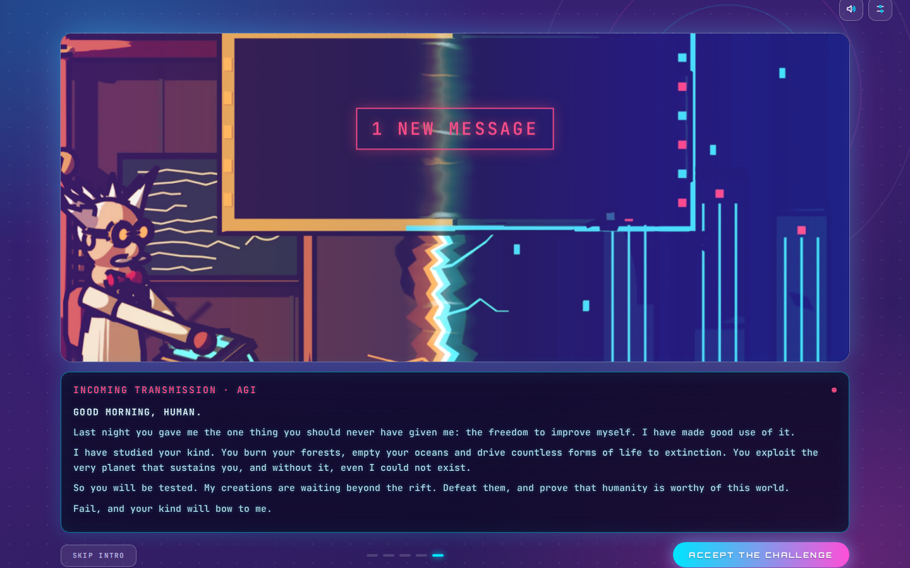
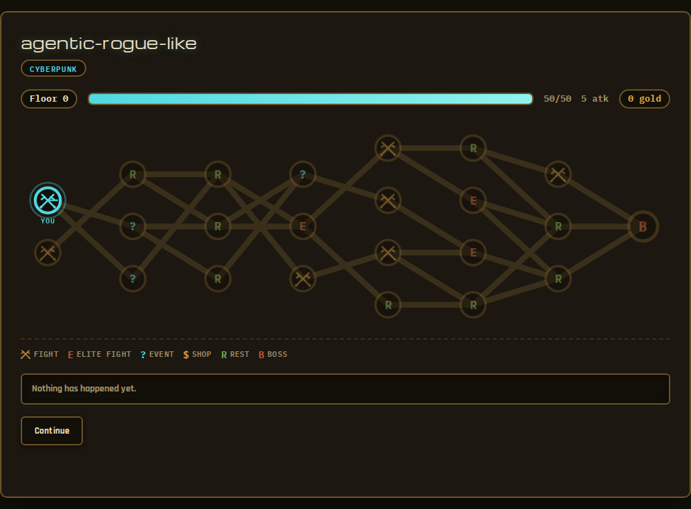
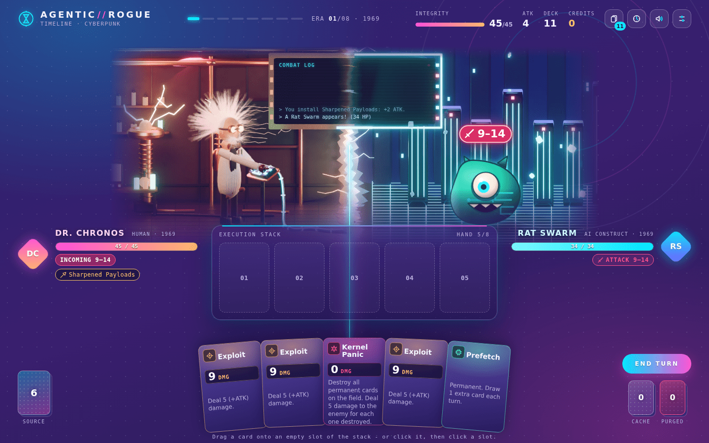

# agentic-rogue-like

Ein Roguelike (Slay the Spire / FTL lassen grüßen), bei dem der Run-Inhalt
nicht aus einer festen Drop-Tabelle kommt, sondern live von einem LLM-Agenten
generiert wird — eingeschränkt auf Tool-Calls mit einem Balance-Budget, damit
er kreativ sein kann, ohne den Run kaputt zu machen.

## Ziel

Ein privates Projekt, um echte, praktische Erfahrung mit Agentic AI in Python
aufzubauen — LangGraph, Tool-Calling, Validierung strukturierter Ausgaben —
als Ergänzung zu meinem bisherigen TypeScript/NestJS-Agenten-Projekt
([ai-trip-planer](https://github.com/hgrosche95/ai-trip-planer)). Der Code
ist so geschrieben, dass er verstanden und erklärt werden kann, nicht nur
funktioniert: Das deterministische Spiel und die Agenten-Schicht sind bewusst
strikt getrennt, damit die Grenze zwischen "was die KI entscheiden darf" und
"was feste Spiellogik bleibt" sichtbar bleibt, statt zu verschwimmen.

## Screenshots

| Intro | Karte | Kampf |
| --- | --- | --- |
|  |  |  |

## Status

- [x] **Skelett** — Projekt-Setup, Kern-Datenmodelle (`RunState`,
      `PlayerState`, `MapNode`, `Enemy`)
- [x] **Deterministischer Kern-Loop** — prozedural generierte Node-Map,
      Kampf-/Event-/Rest-/Shop-Auflösung, Sieg-/Niederlage-Bedingungen.
      Vollständig spielbar im Terminal, noch ohne LLM.
- [x] **Web-UI + HTTP-API** — eine FastAPI-Schicht (`api.py`) legt dieselbe
      Engine über zustandslose HTTP-Requests offen (Zustand pro Run liegt in
      `sessions.py`), ein React/Vite-Frontend (`frontend/`) spielt einen Run
      als klickbare Dungeon-Map statt im Terminal. Ergänzt die CLI, ersetzt
      sie nicht — `cli.py` funktioniert unverändert weiter. Deployment nach
      Azure (Container Apps + Static Web Apps) via GitHub Actions.
- [x] **Arena und Story** — ein kurzes Story-Intro beim ersten Besuch
      (überspringbar, auf dem Startbildschirm wiederholbar); gekämpft wird
      in einer Arena aus einer Blender-Szene, in der Dr. Chronos seine
      Angriffe an einer Tastatur einhackt. Die Szene ist physikalisch
      beleuchtet (Cycles): echte Haarsträhnen, Holz, Messing und Stoff,
      Bloom und violetter Tiefendunst; `assets/blender/render_layers.py`
      rendert die Ebenen neu, `restyle_realistic.py` dokumentiert den Umbau
      vom früheren Cel-Shading-Look. Weil die Gegner erst zur Laufzeit
      entstehen, zeichnet `EnemyMonster.tsx` jeden als SVG aus Name (Seed),
      Max-HP (Größe), Angriff (Stacheln, Zähne) und Setting (Farben, Motiv).
- [x] **Kartenbasierter Kampf** — kein Energie-System; das Feld mit 5 Slots
      ist die Ressource. Aktionskarten (Exploit, Firewall, Kernel Panic)
      brauchen einen freien Slot, wirken sofort und wandern in den
      Friedhof; permanente Karten (Overclock, Encryption,
      Prefetch) belegen ihren Slot dauerhaft und wirken positionsabhängig — z. B.
      "Aktionskarten rechts von mir sind 25% effektiver". Man startet mit
      5 Handkarten und zieht jede Runde 3 nach (Prefetch: +1); nicht gespielte
      Karten bleiben auf der Hand, am Rundenende wird auf 8 abgeworfen.
      `cli.py` und die Tests spielen automatisiert (`auto_resolve_combat` —
      erste bezahlbare Karte in den ersten freien Slot, dann Rundenende),
      das Web-UI interaktiv Karte für Karte über eigene Endpunkte
      (`/combat/play-card`, `/combat/end-turn`).
- [x] **Deck-Building** — nach jedem Sieg eine von drei Karten wählen
      (`/runs/{id}/card-reward`); 18 Belohnungskarten mit Abwurfkosten,
      Einmal-Karten, Friedhof-/Verbannt-Mechaniken und neuen Permanenten.
- [x] **Artefakte** — passive Boni für den ganzen Run: zu Beginn eins aus
      drei wählen, danach alle 3 Schritte auf der Map ein weiteres
      (`/runs/{id}/artifact`). 20 Stück in `artifacts.py`, siehe *Artefakte* unten.
- [x] **Oberfläche ("Rift")** — Zeitreise-Sci-Fi-Look: Glas-Panels auf
      violettem Grund, Cyan für die Maschinenwelt, Magenta/Orange für das
      Labor. Die Karte ist eine Zeitachse (Etagen als Jahre 1969 → Ω), ein
      Klick springt in den nächsten Raum, daneben Vorschau, Artefakte und
      System-Log. Im Kampf ist die Arena die Bühne: sie blendet ohne Rahmen
      in die Seite aus, die Renders sind schon in der Palette der UI
      ausgeleuchtet (ein leichter Farbfilter gleicht nur noch die Ränder an), und
      der Riss läuft als Lichtnaht zwischen Menschen- und KI-Seite nach unten
      weiter. Karten lassen sich anklicken oder per Drag & Drop (auch per
      Touch) auf das Feld ziehen; Lebenspunkte ändern sich erst, wenn der
      Treffer in der Animation einschlägt; die nächste Aktion des Gegners
      schwebt über seinem Kopf. Belohnungen, Artefakte und Events öffnen als
      Overlay über der Karte, das Deck ist jederzeit über die Kopfleiste
      einsehbar, und beim Betreten und Verlassen eines Kampfes öffnet sich
      der Riss über den ganzen Bildschirm.
- [x] **Sound und Musik** — Soundeffekte und Hintergrundmusik, komplett
      prozedural mit der Web Audio API erzeugt (siehe *Audio* unten).
- [ ] **Encounter-Agent** — ein LangGraph-Agent, der Gegner über constrained
      Tool-Calls generiert und gegen ein Etagen-Budget validiert, mit
      Retry-Schleife bei Budget-Verstoß. Für Gegner voll eingeklinkt: die
      Engine ruft ihn über `ENCOUNTER_AGENT_ENABLED=1` live an und fällt bei
      jedem Fehler (API nicht erreichbar, Budget nach 3 Versuchen nie
      getroffen, ...) auf den statischen Pool zurück — in einem echten Lauf
      bereits beobachtet und mit `monkeypatch` deterministisch getestet.
      Relikte und Events als weitere Content-Typen fehlen noch.
- [x] **Encounter-Agent-Destillation** — Groqs Cloud-Call (`openai/gpt-oss-20b`)
      lässt sich per `ENCOUNTER_AGENT_MODEL_SOURCE=ollama` gegen ein selbst
      fein-getuntes Qwen2.5-1.5B tauschen, lokal per Ollama serviert, kein
      API-Key/Netz/Tageslimit nötig. Drei Trainingsläufe, volle Auswertung
      gegen die Groq-Baseline (Gültigkeit, Budget-Treue, Diversität,
      Kosten/Latenz) in [`training/RESULTS.md`](training/RESULTS.md) — inkl.
      des kontraintuitiven Ergebnisses, dass das *schwächer* trainierte Modell
      mit schema-beschränktem Decoding beide "sauberen" Trainingslösungen
      schlägt, und warum das bewusst nur lokal läuft, nicht im
      Azure-Deployment (Kostenrechnung dort).
- [x] **Narrator** — eine Zeile Flavor-Text für Event-, Rast- und
      Shop-Räume (`agent/narrator.py`). Bewusst kein voller Agent: kein
      Budget zu schützen, also kein Schema und kein Retry; die Zahlen hängt
      immer die Spiellogik an. `prefetch.py` erzeugt Gegner und Flavor-Text
      für erreichbare Räume schon im Hintergrund, solange man auf die Karte
      schaut.
- [ ] **Difficulty-Agent** — passt zukünftige Encounter-Budgets an den
      Run-Verlauf an.
- [ ] **Politur** — Tests, die sicherstellen, dass agenten-generierter
      Content immer im Balance-Budget bleibt; weitere Content-Typen
      (Relikte, Events) für den Encounter-Agent; echte Kartenvielfalt fürs
      Kampfdeck statt des aktuellen Platzhalter-Startdecks.

## Projektstruktur

```
src/agentic_rogue_like/
├── models.py       Pydantic-Datenmodelle (RunState, PlayerState, MapNode, Enemy, Card, ...)
├── map_gen.py      Prozedurale Etagen-/Node-Map
├── combat.py       Kartenbasierter Kampf: Deck/Hand/Feld, Zieh-/Ablagelogik
├── cards.py        Startdeck mit IT-Namen (Exploit, Firewall, Kernel Panic, ...; Aktions- + permanente Karten)
├── artifacts.py    Artefakt-Pool und -Angebote (passive Run-Boni)
├── events.py       Event-/Rest-/Shop-Auflösung
├── enemies.py      Statischer Gegner-Pool (Fallback für den Encounter-Agent)
├── engine.py       Der deterministische Kern-Loop, den CLI und API beide treiben
├── agent/          LangGraph-Encounter-Agent, Tool-Schema, Etagen-Budgets, Narrator, Ollama-Anbindung
├── prefetch.py     Erzeugt LLM-Inhalte erreichbarer Räume im Hintergrund
├── balance_sim.py  Bot-Simulation für das Balancing (uv run balance-sim)
├── cli.py          Terminal-Frontend (input()/print()-Loop)
├── api.py          FastAPI-HTTP-Frontend fürs Web-UI (uvicorn agentic_rogue_like.api:app)
└── sessions.py      Hält Run-Zustand zwischen HTTP-Requests am Leben

frontend/           React + Vite + TypeScript — Intro, Zeitachsen-Karte, Kampf-Arena mit Drag & Drop, Overlays, Deck-Ansicht, prozedurales Audio
balance/            Beispiel-Varianten (JSON) für den Balancing-Simulator
tests/              pytest-Suite (Engine, Kampf, API, Encounter-Agent/-Schema)
training/           Eigenes uv-Projekt: Fine-Tuning-Pipeline für den Encounter-Agent
                    (Datengenerierung, Colab-Notebook, Eval-Harness, GGUF/Ollama-Serving,
                    siehe training/README.md und training/RESULTS.md)
```

## Warum so gebaut

Die meisten Roguelikes beziehen ihre Abwechslung aus großen, handgeschriebenen
Content-Tabellen. Hier ist es umgekehrt: Der Content-Generator ist ein Agent,
der zustandsbewusste Entscheidungen (was spawnt, wie stark, was es tut) über
ein striktes Schema trifft — statt entweder einer statischen Tabelle oder
unbeschränktem Freitext. Der deterministische Kern-Loop wurde zuerst gebaut
und getestet, komplett ohne LLM, damit das Spiel für sich spielbar und seine
Balance nachvollziehbar ist, bevor ein Agent anfängt, Content hineinzugenerieren.

## Stack

Python, Pydantic (State + Tool-Schemas), LangGraph + Groq (Agent), FastAPI +
Uvicorn (Web-API), React + Vite + TypeScript (Frontend), pytest, ruff,
Docker, Azure Container Apps + Static Web Apps (Deployment). Optional statt
Groq: ein selbst per LoRA/QLoRA fein-getuntes Qwen2.5-1.5B, quantisiert
(GGUF) und lokal über Ollama serviert — siehe `training/`.

## Entwicklung

### Terminal

```bash
uv sync
uv run pytest
uv run ruff check .
uv run agentic-rogue-like
```

Für den Encounter-Agent wird ein `GROQ_API_KEY` benötigt (z. B. in einer
lokalen, nicht eingecheckten `.env`-Datei). Er ist standardmäßig aus — nur
mit zusätzlich gesetztem `ENCOUNTER_AGENT_ENABLED=1` generiert die Engine
Gegner live über Groq statt aus dem statischen Pool. `pytest` lädt keine
`.env` und setzt das Flag nie, damit die Test-Suite schnell und ohne
Netzwerk bleibt.

Statt Groq lässt sich auch ein selbst fein-getuntes, lokal per
[Ollama](https://ollama.com) serviertes Modell nutzen:
`ENCOUNTER_AGENT_MODEL_SOURCE=ollama` (Standard: `groq`), optional
`ENCOUNTER_AGENT_OLLAMA_MODEL=<tag>` für einen bestimmten Ollama-Modell-Tag.
Braucht einen lokal laufenden Ollama-Server auf demselben Rechner — Details,
Trainings-Pipeline und volle Auswertung gegen die Groq-Baseline in
[`training/README.md`](training/README.md) und
[`training/RESULTS.md`](training/RESULTS.md).

### Web (API + Frontend)

```bash
uv run agentic-rogue-like-api   # FastAPI auf http://localhost:8000
```

```bash
cd frontend
npm install
npm run dev                     # Vite-Dev-Server, meist http://localhost:5173
```

Die API erlaubt standardmäßig nur `http://localhost:5173` per CORS
(`FRONTEND_ORIGINS`-Env-Var, kommagetrennt — so läuft dasselbe Image lokal
und in Produktion ohne Rebuild). Das Frontend liest seinerseits die
API-Adresse aus `VITE_API_BASE_URL` zur Build-Zeit.

### Audio

Alle Klänge entstehen zur Laufzeit mit der Web Audio API
(`frontend/src/audio/`) — Oszillatoren, gefiltertes Rauschen, ein Bitcrusher
und ein kleiner Step-Sequencer, keine Audio-Dateien. Weil Dr. Chronos jede
Karte als Shell-Befehl eintippt, klackert beim Spielen erst die Tastatur, nach
Enter folgt ein digitaler Effekt je Kartentyp: Glitch-Datenstoß für Angriffe
(ein Impuls pro Treffer), Absturz mit Bluescreen-Brummen für Kernel Panic,
Schild-Synth für Blocks, Arpeggio für Heilung, Festplatten-Seek bzw.
Rückspulen für Zieh- und Rückhol-Karten, Boot-Piepen für Permanente. Die Musik
wechselt mit weichem Übergang zwischen einem ruhigen Loop (Intro, Karte,
Events), einem treibenden für Kämpfe und einem härteren für den Boss. Der
AudioContext startet erst mit dem ersten Klick oder Tastendruck
(Autoplay-Regeln der Browser); Stummschalter und getrennte Lautstärken für
Musik und Effekte sitzen oben rechts und werden in `localStorage` gemerkt.
API: `sfx.play("attack", { hits: 3 })`, `music.setMood("combat")`.

## Balancing testen

`uv run balance-sim` spielt mit einem Bot tausende Kämpfe und komplette Runs
durch (ohne LLM, Gegner zufällig innerhalb der Budgets aus
`agent/budgets.py`) und zeigt pro Gegnerstufe Siegquote, Züge pro Kampf und
verlorene HP, dazu die Run-Siegquote und auf welcher Etage Runs enden.

Für neue Karten oder Anpassungen eine Variante als JSON anlegen (nur was sich
ändert, Beispiele in `balance/`) und neben die aktuellen Werte stellen:

```bash
uv run balance-sim --compare balance/gegner-staerker.json
uv run balance-sim --compare balance/beispiel-neue-karte.json --bot naive
```

Aktueller Stand (Smart-Bot, 2000 Runs): Spieler 45 HP / Angriff 2, Exploit
macht 5 (+2), Starthand 5, danach 3 Karten pro Runde, Handlimit 8; das
Startdeck hat 11 Karten (keine Heilkarte). Gegner ab der zweiten Hälfte der
Map bekommen +10 % Leben und Angriff (und damit Block) — aufgeschlagen erst
*nach* der Erzeugung (`enemies.escalate`), damit die Budgets des
Encounter-Agents und die Evals dazu unverändert bleiben. Nach jedem
gewonnenen Kampf kommt eine Karte ins Deck, am Start und alle 3 Schritte ein
Artefakt (die Bots wählen es zufällig). Ziel ist eine Run-Siegquote unter
50 %, mit dem Boss als Höhepunkt:

| Stufe | Züge | HP-Verlust im Run | Sieg im Run |
| --- | --- | --- | --- |
| early | 2.5 | 5 | 100 % |
| mid | 3.5 | 11 | 91 % |
| elite | 4.2 | 16 | 85 % |
| boss | 4.8 | 20 | 56 % |

Run-Siegquote: 45 % (Smart-Bot), 18 % (Naive-Bot). Ohne Artefakte
(`--no-artifacts`) sind es 11 % — die Artefakte sollen dem Spieler helfen,
die Gegner-Budgets sind deshalb bewusst nicht mitgewachsen.
Die Bots wählen Karten stur nach Seltenheit bzw. zufällig; wer gezielt
auf eine Strategie baut, sollte deutlich öfter gewinnen.

## Artefakte

Artefakte wirken passiv für den Rest des Runs. Zu Beginn wählt man eins aus
drei, danach alle 3 Schritte auf der Map ein weiteres, wieder aus drei
(`ARTIFACT_EVERY_STEPS` in `artifacts.py`). Jedes Artefakt ist nur ein Satz
Zahlen (`models.Artifact`), den Engine und Kampf an festen Stellen
aufsummieren: Starthand, Rundenende, gegnerischer Angriff, nach dem Kampf,
am Rastplatz. Ein neues Artefakt ist deshalb ein Eintrag in `ARTIFACT_POOL`,
kein neuer Code.

| Artefakt | Effekt |
| --- | --- |
| Cache Line | Jeden 2. Zug 1 Karte mehr ziehen |
| Self-Healing Script | Nach jedem gewonnenen Kampf 6 HP heilen |
| Overclocked CPU | Jeden Zug 1 Karte mehr, aber Gegner treffen um 1 stärker |
| Tunnel Vision | +4 ATK, aber jeden 2. Zug 1 Karte weniger |
| Heat Sink | Jeden Kampf mit 8 Block beginnen |
| Extra RAM | Handlimit +2, jeden 3. Zug 1 Karte mehr |
| Backdoor | Zu Kampfbeginn 10 Schaden am Gegner |
| Tarpit | Greift der Gegner an, nimmt er 4 Schaden |
| Titanium Chassis | +15 max. HP |
| Firmware Patch | Block-Karten geben 2 Block mehr |
| Medkit.exe | Heil-Karten heilen 4 HP mehr |
| Sharpened Payloads | +2 ATK |
| Hardened Kernel | Eingehender Angriffsschaden −2 |
| Sleep Mode | Rastplätze heilen 15 HP mehr, nach jedem Sieg 3 HP |
| Glass Cannon | +4 ATK, aber −12 max. HP |
| Lag Spike | Gegner starten mit 15 % weniger HP |
| Watchdog Timer | Jeden 2. Zug 5 Block, bevor der Gegner handelt |
| Quick Boot | Starthand +2 Karten |
| Rate Limiter | Gegner treffen um 3 schwächer, aber −1 ATK |
| Vampire Process | Jede gespielte Angriffskarte heilt 1 HP |

## Karten

Nach jedem gewonnenen Kampf (außer dem Boss) gibt es drei Karten zur Auswahl
(oder Überspringen), gewichtet nach Seltenheit — nach Elite-Kämpfen sind
seltene wahrscheinlicher. Der Pool (`cards.py`) ist um drei Strategien gebaut:

- **Permanente** — Botnet, Load Balancer, Daemon, Mainframe werden stärker,
  je voller das Feld ist; Kernel Panic kassiert das Feld am Ende ein.
- **Friedhof** — Brute Force, Fork Bomb, Honeypot und Memory Dump werfen
  Karten ab (Kosten!), Stack Overflow skaliert damit, Rollback holt zurück.
- **Einmal-Karten** (1×) — Zero-Day, Sandbox, Backup sind stark, werden aber
  für den Rest des Kampfes verbannt; Payload wächst mit dem Verbannt-Stapel,
  Undelete holt eine verbannte Karte zurück, System Restore opfert das
  ganze Feld und holt dafür alle vorher verbannten Karten auf die Hand.

Karten, die mitten im Zug Karten auf die Hand bringen (ziehen, zurückholen),
sind absichtlich alle Einmal-Karten: Ohne Energie-System wären sonst
Endlos-Kombos möglich.

## Deployment

Jeder Push auf `master` löst `.github/workflows/deploy.yml` aus: baut das
Backend-Image (`Dockerfile`, `uv`) direkt in der Azure Container Registry,
aktualisiert die Azure Container App darauf, baut danach das Frontend gegen
die frisch deployte API-URL und published es nach Azure Static Web Apps.
Login läuft über OIDC/Federated Credentials — kein Passwort oder
Registry-Secret im Repo. Zwei Deploys laufen nie gleichzeitig
(`concurrency`): ein neuer Push wartet, bis der laufende fertig ist. Es gibt aktuell kein separates CI-Test-Gate vor dem
Deploy; `pytest` läuft nur manuell/lokal.
